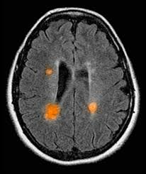

# AI Doctor with Vision & Voice

AI Doctor with Vision & Voice is an interactive healthcare assistant powered by multimodal AI. It analyzes medical images and patient speech, providing concise, human-like medical insights and voice responses. Built with Gradio, Groq, Whisper, and gTTS, it demonstrates the potential of AI in telemedicine and patient engagement.

## Features

- **Speech-to-Text:** Converts patient voice input to text using Whisper via Groq API.
- **Image Analysis:** Uses vision-capable LLMs to interpret medical images and provide differential diagnoses.
- **Doctor-like Responses:** Generates professional, empathetic medical advice in natural language.
- **Text-to-Speech:** Delivers AI doctor's response as spoken audio using gTTS.
- **User-Friendly Interface:** Gradio-powered web app for seamless interaction.

## Demo



## Getting Started

### Prerequisites

- Python 3.10+
- Groq API Key
- Hugging Face API Key
- FFmpeg (for audio processing)

### Installation

```sh
git clone https://github.com/yourusername/ai-doctor-with-vision-voice.git
cd ai-doctor-with-vision-voice
pip install -r requirements.txt
```

### Environment Setup

Copy `.env.example` to `.env` and add your API keys.

### Run the App

```sh
python gradio_app.py
```

## Usage

1. Record your voice describing symptoms or concerns.
2. Upload a medical image (e.g., MRI, X-ray).
3. Receive a doctor's analysis in text and voice.

## File Structure

- `gradio_app.py` — Main Gradio interface.
- `brain_of_the_doctor.py` — Image encoding and analysis.
- `voice_of_the_patient.py` — Audio recording and transcription.
- `voice_of_the_doctor.py` — Text-to-speech synthesis.
- `.env` — API keys (not tracked in git).
- `requirements.txt` — Python dependencies.


## Contributing

Pull requests are welcome! For major changes, please open an issue first to discuss what you would like to change.

## License

This project is for educational purposes. See LICENSE for details.

## Acknowledgements

- [Gradio](https://gradio.app/)
- [Groq](https://groq.com/)
- [gTTS](https://pypi.org/project/gTTS/)
- [Whisper](https://github.com/openai/whisper)
- [Pydub](https://github.com/jiaaro/pydub)

---

*Disclaimer: This tool is not a substitute for professional medical advice. Always consult a qualified healthcare provider
